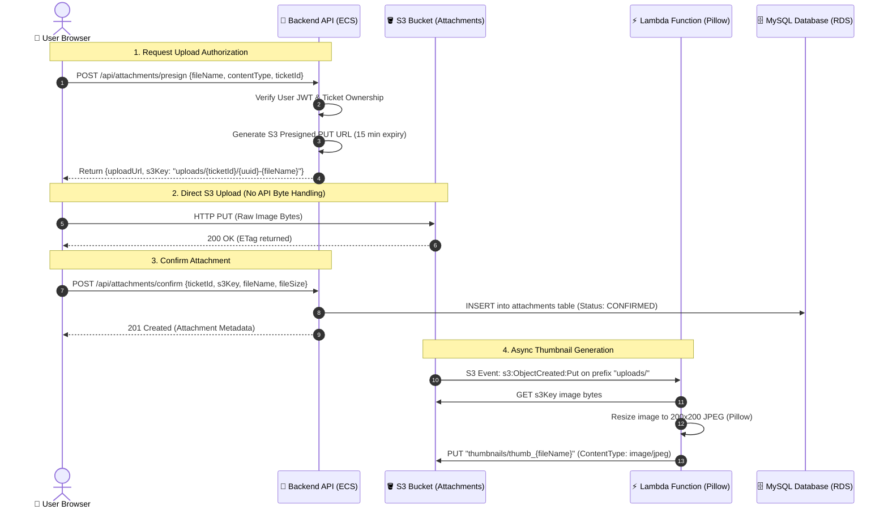
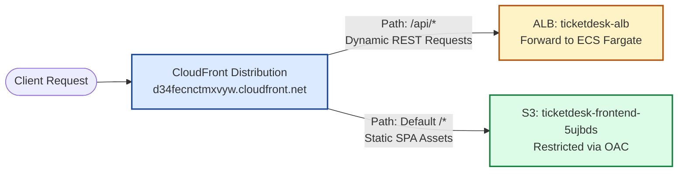

# 🏛️ TicketDesk — AWS Cloud Architecture Specification

This document provides the in-depth architectural design, network topology, security boundaries, and data flow patterns for the **TicketDesk Cloud Platform**.

---

## 1. Network Topology & Isolation

The network infrastructure is provisioned within a custom AWS Virtual Private Cloud (VPC) spanned across **two Availability Zones** (`us-east-1a` and `us-east-1b`) to guarantee high availability and fault isolation.

```text
VPC: 10.0.0.0/16 (us-east-1)
│
├── Public Subnets (Ingress & Egress)
│   ├── us-east-1a: 10.0.1.0/24  ──> Internet Gateway (IGW) + NAT Gateway + ALB (Public Interface)
│   └── us-east-1b: 10.0.2.0/24  ──> Internet Gateway (IGW) + ALB (Public Interface)
│
├── Private Application Subnets (Compute Tier)
│   ├── us-east-1a: 10.0.11.0/24 ──> Route to NAT Gateway (Outbound Only) ──> ECS Fargate Task 1
│   └── us-east-1b: 10.0.12.0/24 ──> Route to NAT Gateway (Outbound Only) ──> ECS Fargate Task 2
│
└── Private Database Subnets (Data Persistence Tier)
    ├── us-east-1a: 10.0.21.0/24 ──> No Internet Routes (Isolated) ──> RDS MySQL Instance
    └── us-east-1b: 10.0.22.0/24 ──> No Internet Routes (Isolated) ──> RDS Subnet Group Standby
```

### Key Routing & Security Boundaries:
1. **Zero Public Ingress to Compute**: ECS Fargate tasks reside strictly in private application subnets. They possess no public IP addresses.
2. **Strict Security Group Chaining**:
   * **ALB Security Group** (`ticketdesk-alb-sg`): Allows ingress on TCP `80` from `0.0.0.0/0`.
   * **ECS Backend Security Group** (`ticketdesk-ecs-backend-sg`): Only allows ingress on TCP `8080` from `ticketdesk-alb-sg`.
   * **RDS Security Group** (`ticketdesk-rds-sg`): Only allows ingress on TCP `3306` from `ticketdesk-ecs-backend-sg`.

---

## 2. Serverless Direct S3 Upload & Thumbnail Processing (M5)

The file attachment architecture adheres strictly to the **zero-API byte handling** design principle:



---

## 3. Global Edge CDN Routing (CloudFront + OAC)

The CloudFront CDN distribution (`E3VZTH6XGJXK77`) provides a unified single-origin domain experience:



* **Origin Access Control (OAC)**: The S3 static hosting bucket has all public access blocked. It only allows reads from CloudFront using AWS SigV4 signed requests.
* **SPA Routing**: CloudFront routes React Router HTML5 pushState requests seamlessly to `index.html`.

---

## 4. Secrets & Configuration Management

Sensitive secrets are never committed to version control or baked into container images:

```text
AWS Secrets Manager:
├── /ticketdesk/production/db_password ──> Injected into ECS Fargate task definition at runtime
└── /ticketdesk/production/jwt_secret  ──> Injected into ECS Fargate task definition at runtime

AWS Systems Manager (SSM) Parameter Store:
├── /ticketdesk/production/SPRING_DATASOURCE_URL      ──> jdbc:mysql://ticketdesk-db...:3306/ticketdesk_db
└── /ticketdesk/production/SPRING_DATASOURCE_USERNAME ──> ticketdesk_user
```

---

## 5. Observability & Monitoring Architecture

Full-stack operational telemetry is ingested, visualized, and alarmed automatically:

```mermaid
flowchart TD
    ECS[ECS Fargate Tasks] -->|awslogs driver (14-Day Retention)| CWLogs[CloudWatch Log Group: /ecs/ticketdesk-backend]
    ALB[Application Load Balancer] -->|Metrics: RequestCount, Latency, 5xx| CWMetrics[CloudWatch Metrics]
    ECS -->|Metrics: CPUUtilization, MemoryUtilization| CWMetrics
    RDS[RDS MySQL] -->|Metrics: CPUUtilization, Connections| CWMetrics

    CWMetrics --> Dashboard[CloudWatch Operations Dashboard<br/>ticketdesk-operations-dashboard]
    
    CWMetrics --> Alarm1[Alarm: High 5xx Errors > 5]
    CWMetrics --> Alarm2[Alarm: Unhealthy Targets >= 1]
    CWMetrics --> Alarm3[Alarm: RDS High CPU > 80%]

    Alarm1 --> SNS[Amazon SNS Topic: ticketdesk-alerts-topic]
    Alarm2 --> SNS
    Alarm3 --> SNS
    SNS --> Email[📧 Email Notifications]
```
