# 🎙️ TicketDesk — 10-Minute Facilitator Demonstration Script

This document is the official presentation runbook for demonstrating the **TicketDesk Cloud Platform** to evaluators and facilitators for final capstone sign-off.

---

## ⏱️ Presentation Timeline (10 Minutes Total)

```mermaid
gantt
    title 10-Minute Demonstration Agenda
    dateFormat  m
    axisFormat  %M min
    section Introduction
    Architecture Overview (M1-M4) :0, 2m
    section Feature Demo
    Direct S3 Upload & Lambda Thumbnail (M5) :2, 5m
    section CI/CD
    GitHub Actions Deployment Walkthrough (M6) :5, 7m
    section Observability & Hardening
    CloudWatch Dashboard & 3 Alarms (M7-M8) :7, 9m
    Load Test & Cost Breakdown :9, 10m
```

---

## 🎬 Step-by-Step Demo Flow

### 1. 🏗️ Architecture & High Availability (0:00 – 2:00)
1. Open the live production URL: [https://d34fecnctmxvyw.cloudfront.net](https://d34fecnctmxvyw.cloudfront.net)
2. Explain the multi-tier architecture:
   * Global edge caching via CloudFront CDN distribution with Origin Access Control (OAC).
   * Multi-AZ custom VPC (`10.0.0.0/16`) spanning `us-east-1a` and `us-east-1b`.
   * Public Application Load Balancer routing dynamic requests to 2 private ECS Fargate tasks with zero public IPs.
   * Isolated Amazon RDS MySQL in private database subnets with no internet ingress.

---

### 2. ⚡ Milestone M5: Serverless Presigned S3 Upload & Lambda (2:00 – 5:00)
1. Log in with employee credentials (`user1` / `password`).
2. Navigate to **Support Tickets** $\rightarrow$ Click **Create New Ticket**.
3. Fill out ticket details and choose an image attachment (e.g. screenshot).
4. Open the **Browser Developer Tools $\rightarrow$ Network Tab**:
   * Show `POST /api/attachments/presign` returning the presigned S3 PUT URL.
   * Highlight the direct `PUT https://ticketdesk-attachments-5ujbds.s3.amazonaws.com/uploads/...` streaming raw bytes from the browser straight to S3 without touching backend API RAM.
   * Show `POST /api/attachments/confirm` recording metadata in RDS.
5. Open the newly created ticket details:
   * Demonstrate the **200×200 JPEG thumbnail** generated asynchronously by the Python Pillow Lambda function in `thumbnails/`!

---

### 3. 🚀 Milestone M6: Automated CI/CD Pipeline (5:00 – 7:00)
1. Open the GitHub Actions tab: [https://github.com/anu123sri/awscapstone/actions](https://github.com/anu123sri/awscapstone/actions)
2. Show recent automated runs triggered on push to `main`:
   * **Stage 1 (Quality Check)**: Gitleaks scanning for committed secrets + Maven unit tests running on JDK 21.
   * **Stage 2 (Build & Push)**: Multi-stage Docker build tagged with Git SHA and pushed to ECR.
   * **Stage 3 (Deploy)**: Zero-downtime ECS rolling deployment + React S3 sync + CloudFront cache invalidation.
   * **Stage 4 (Smoke Test)**: Automated curl validation against `https://d34fecnctmxvyw.cloudfront.net/api/health`.

---

### 4. 📊 Milestone M7: Observability, Dashboard & Alarms (7:00 – 9:00)
1. Open CloudWatch Console:
   * **Operations Dashboard**: `ticketdesk-operations-dashboard` displaying live ALB RequestCount, TargetResponseTime, ECS CPU/Memory, and RDS Database Connections.
   * **Log Groups**: `/ecs/ticketdesk-backend` with finite **14-day retention policy**.
   * **Metric Alarms**: Show all 3 alarms in **`OK`** state:
     * `ticketdesk-alb-high-5xx-errors`
     * `ticketdesk-unhealthy-ecs-targets`
     * `ticketdesk-rds-high-cpu`
   * Explain the Amazon SNS topic (`ticketdesk-alerts-topic`) wired for immediate incident notifications.

---

### 5. 🏆 Milestone M8: Load Test & Cost Report (9:00 – 10:00)
1. Show the load sanity check result from `scripts/load_test.py`:
   * **2,010 requests executed across 20 concurrent users with 0 errors (0.00% error rate)**.
2. Present the **One-Page Cost Report** ([`cost_report.md`](cost_report.md)):
   * Total estimated spend: **~$86.15 / month**.
   * **#1 Most Expensive**: NAT Gateway ($32.40/mo) for private subnet egress.
   * **#2 Most Expensive**: RDS MySQL Database ($16.50/mo) for ACID storage.
3. Confirm 100% universal resource tagging (`Project`, `Owner`, `Environment`, `CostCenter`, `ManagedBy`).
